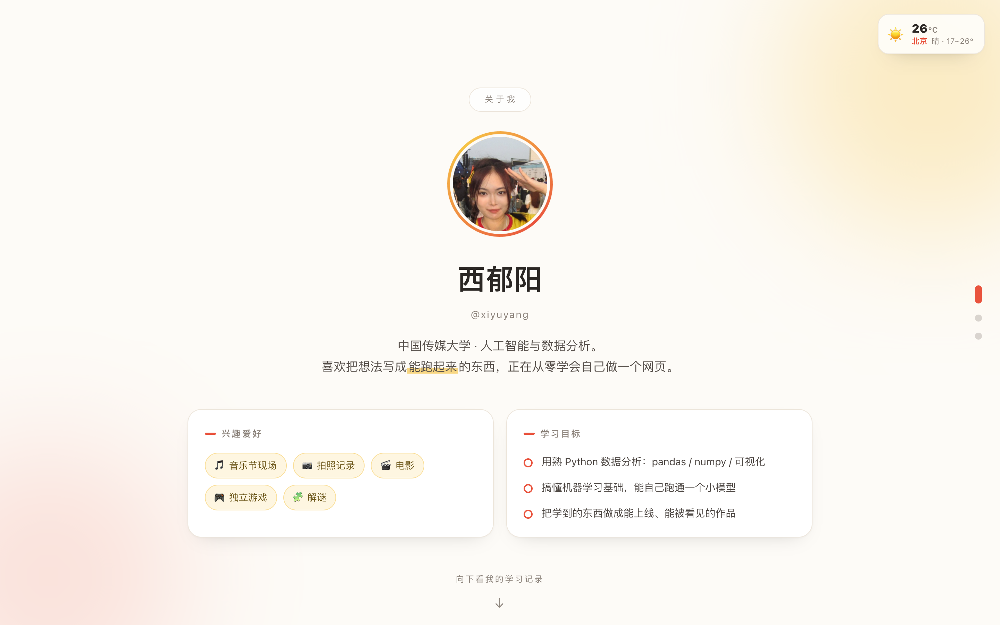

# 我的个人主页

一个个人主页，三屏：

1. **关于我** —— 头像、昵称、一句话介绍、兴趣爱好、学习目标
2. **我的学习记录** —— 时间线
3. **一键去除图片背景** —— 上传 / 拖拽图片，导出透明 PNG。**两条路自动选**（见下）

右上角固定显示北京实时天气（Open-Meteo，免 Key）。



---

## 快速开始

**只想看页面 / 直接用：双击 `index.html` 就行。** 三屏都能用，第三屏走浏览器本地模型，
不需要装任何东西、不需要 token。（模型首次用时从 CDN 下 6.6MB。）

下面这套是**想走 Replicate 那条路**（抠图质量更好）才需要的：

```bash
npm install              # 装依赖
cp .env.example .env     # 然后编辑 .env，填入你的 REPLICATE_API_TOKEN
npm run check:token      # 先验一下 token 通不通（不消耗额度）
npm start                # 启动，浏览器打开 http://localhost:3000
```

Token 在这里申请：<https://replicate.com/account/api-tokens>

> `.env` 已经在 `.gitignore` 里，**不会被提交**。不要把 token 写进代码或 README。

`npm run check:token` 会读 `.env`、真发一次认证请求，并且把常见的复制毛病指出来
（多带了空格 / 前后有换行 / 长度不对被截断 / 压根没配），认证通过时打印账号名。
比「启动服务、传张图、看报错」快得多。

## 第三屏的两条路（打开页面时自动选）

第三屏要调 AI 模型抠图。**Replicate 的 Key 不能出现在网页里**，所以只要走 Replicate 就必须有个后端；
但页面本身不该因为"没起服务"就变成一张用不了的说明卡。所以做了两条路，自动挑：

| | 什么时候走这条 | 谁来跑 | 特点 |
| --- | --- | --- | --- |
| **Replicate** | 页面由 `server.js` 提供，且 `.env` 里配了 token | 本地 Node 服务 → Replicate `lucataco/remove-bg` | 质量更好，尤其复杂物体和毛发边缘；要联网、要花额度 |
| **浏览器本地** | 其余所有情况：双击打开的 `file://`、GitHub Pages 等纯静态托管、后端没起、token 没配 | 用户自己的浏览器（transformers.js + MODNet） | 免费、不用 Key，**图片不出本机**；首次要下 6.6MB 模型，之后走缓存；偏人像 |

判断方式：`file://` 直接用本地；否则探一下 `GET /api/health`，通了且 `tokenConfigured` 为真才用 Replicate，
其他情况**静静回落到浏览器本地**。页面标题下面那行小徽标会写出当前走的是哪条，鼠标悬停有解释。

所以现在 **GitHub Pages 上也能真用**，不需要任何后端。想跑 Replicate 那条路仍然按上面的「快速开始」来。

## 文件说明

```
index.html                        整个前端（唯一一个 html）
avatar.jpg                        头像
server.js                         Express 后端：去背景接口
package.json                      依赖与脚本
.env.example                      环境变量模板（复制成 .env 用）
.gitignore                        忽略 node_modules / .env / .workbuddy
README.md                         本文件
tools/
  check.js                        静态页自检（file:// 打开，查布局/头像/天气/第三屏可用性 + 窄屏裁切扫描）
  check-local.js                  「浏览器本地模型」那条路的端到端自检（会真跑一次抠图）
  check-removebg.js               「后端 Replicate」那条路的交互自检（自己拉服务，用假 token，不花钱）
  check-token.js                  验 .env 里的 token 能不能过认证（不消耗额度）
  check-e2e.js                    真实端到端：真调 Replicate 模型抠一张图（⚠️ 消耗一次模型调用）
  make-avatar.py                  从原照片裁正方形头像
  screenshots/                    自检产出的截图（可随时删，重跑会再生成）
```

## 浏览器本地那条路用的模型

`index.html` 顶部 script 里两行常量：

```js
var TF_CDN = 'https://cdn.jsdelivr.net/npm/@huggingface/transformers@3';
var MODEL_ID = 'Xenova/modnet';
```

- 运行时是 **transformers.js 3.8.1**（Apache-2.0），模型是 **MODNet**，Apache-2.0。
  **许可证很重要**：这类工具最常被推荐的 `briaai/RMBG-1.4` 是**非商用**许可，放公开仓库要当心。
- 加载 `dtype: 'q8'` 拿的是量化版权重，**6.6MB**（`model_quantized.onnx`）；
  换成 `'fp32'` 是 25MB，质量略好，但首次打开慢很多。
- MODNet 是为**人像抠图**训练的，抠真人照片、半透明发丝是强项；抠商品、食物这类
  非人主体时边缘会弱一些 —— 这种图建议走后端那条 Replicate（实测确实更干净）。
- 入参名的坑：processor 输出叫 `pixel_values`，但模型要的键名是 `input`，
  写成 `model(inputs)` 会报 `Missing the following inputs: input`。
- 输出是一张 `[1,1,512,512]` 的 float32 alpha 遮罩。代码没用 `RawImage.putAlpha`，
  而是把遮罩画成只带 alpha 的 canvas、再用 `destination-in` 叠回原图 ——
  这样缩放时浏览器会做插值，边缘更顺，而且不依赖库的具体 API 形态。

## 模型与端点（有个坑，换模型前必读）

去背景走 Replicate 的 `lucataco/remove-bg`，但 **`MODEL` 必须写成 `owner/name:版本hash`**：

```js
const MODEL = 'lucataco/remove-bg:95fcc2a26d3899cd6c2691c900465aaeff466285a65c14638cc5f36f34befaf1';
```

原因是 SDK 会据此选不同的接口（`node_modules/replicate/lib/predictions.js` 第 39 / 55 行）：

| 写法 | 实际请求 | 我们的实测结果 |
| --- | --- | --- |
| `owner/name:hash` | `POST /v1/predictions`，body `{ version, input }` | ✅ 能跑 |
| `owner/name` | `POST /v1/models/{owner}/{name}/predictions` | ❌ 稳定 404 |

**别被这个 404 骗了**：同一路径的 `GET` 是 200、模型也有 `latest_version`、页面也能打开，
看起来像「模型被作者停用了」—— 换成 `851-labs/background-remover`、`men1scus/birefnet`
照样 404，因为问题在端点不在模型。2026-09-29 我就是这么绕了一圈才定位到的。

**想换模型**：去模型页找到 version hash，照样拼成 `owner/name:hash`。
注意入参字段名各家不同（`lucataco/remove-bg` 只有 `image` 一个字段），改完跑 `npm run check:e2e` 真验一次。

### 限速

Replicate 对**余额低于 $5** 的账号把「创建任务」限到**每分钟 6 次、并发 1**，也就是连点两下就会吃一个 429。
`server.js` 里按服务端返回的 `retry_after` 自动重试（最多 3 次），所以偶尔慢几秒是正常的，不是坏了。

## 接口

只有一个：

```
POST /api/remove-bg     multipart/form-data，字段名 image
  200  { ok:true, image:"data:image/png;base64,…", bytes, ms }
  400  { ok:false, error:"图片太大了，请控制在 10MB 以内" }
  500  { ok:false, error:"Replicate 认证失败：…" }
  500  { ok:false, error:"请求太频繁了，Replicate 对低余额账号是每分钟 6 次…" }
  500  { ok:false, error:"模型调用失败（404）：检查 server.js 里的 MODEL…" }

GET  /api/health        返回 { ok, tokenConfigured, model }，前端用它提示 token 没配 / 后端没起
```

后端做的事情：接住上传的图片 → 交给 `replicate.run()`（SDK 会自动把 Buffer 上传成 URL，
并默认等到出图完成）→ 把结果 PNG 下载回来转成 data URI 返回。

转成 data URI 是为了让前端的「下载 PNG」是同源链接 —— 跨域的图片 URL 加了 `download`
属性也是无效的，点一下只会跳过去。

静态文件只显式放行了 `/` 和 `/avatar.jpg`，没有用 `express.static`，
否则 `.env`、`server.js`、`node_modules` 都能被直接下载走。

## 怎么改

| 想改什么 | 改哪儿 |
| --- | --- |
| 头像 | 替换 `avatar.jpg`（正方形最好），文件名不用动 |
| 主题色 | `index.html` 最上面 `:root` 里的 `--accent`（红）/ `--accent-2`（黄） |
| 昵称、介绍、兴趣、学习目标 | `index.html` 里搜「改这里」 |
| 学习记录 | 复制一整块 `<div class="item">…</div>`；最新那条加 `now` 类名和 `<span class="badge">最新</span>` |
| 天气城市 | `index.html` 底部 script 里的 `var CITY = { name, lat, lon }` |
| 浏览器本地那个模型的库 / 模型 | `index.html` 第三屏 script 顶部的 `TF_CDN`、`MODEL_ID`、`MODEL_MB` |
| 怎么决定走哪条路 | `index.html` 第三屏 script 最末尾那段 `location.protocol === 'file:'` + `fetch('/api/health')` 判断 |
| 去背景用的模型（后端那条路） | `server.js` 顶部的 `MODEL`，**必须写成 `owner/name:版本hash`**（只写 `owner/name` 会 404，见上一节） |
| 上传大小上限 / 端口 | `server.js` 顶部的 `MAX_MB`、环境变量 `PORT` |

## 自检

改完跑一遍，确认没改坏：

```bash
npm run check:token             # 只验 token，不消耗额度，不用起服务
npm run check                   # 静态页：布局、头像、天气接口、第三屏可用性、窄屏裁切扫描
npm run check:local             # 浏览器本地模型那条路：真的抠一张图出来（约 10 秒）
npm run check:removebg          # 后端 Replicate 那条路：交互状态（假 token，不花钱）
npm run check:e2e               # 真实端到端：真调 Replicate 模型抠一张图（⚠️ 消耗一次模型调用）
```

四个浏览器脚本都会用无头 Chrome 真打开页面、真发请求，结果逐条打印，有问题会列出来并以非 0 退出码结束。
截图落在 `tools/screenshots/`。**都不需要你自己起服务。**

`check-local.js` 和 `check-removebg.js` 在独立端口（3200 / 3100）上各起一个自己的服务、
**固定用假 token**，所以不会命中你可能开着的真服务、也不会意外烧掉一次真实调用。
想验真实出图效果只有 `check:e2e` 会花钱。

`check-removebg.js` 的 A 场景测失败路径（假 token 必然 401），B 场景用 mock 响应测成功态渲染，
所以不管 token 好不好用都能验证前端。

`check.js` 里有一段**窄屏横向裁切扫描**：从 1440 到 320 逐档量 `scrollWidth > clientWidth`。
只查 `overflow` 不是 `visible` 的元素 —— 那种才会真把内容藏起来。这条是因为踩过坑才加的：
原来第三屏那张说明卡里的命令行块用了 `<pre>` + `white-space:pre` + `overflow-x:auto`，
在 ≤600px 时内容宽 519px、可视只有 290px，**三分之一滚出视野，而 macOS 不显示滚动条，看起来就是文字被硬裁掉**。
（注意 `.avatar-ring` 那种自转圆环 `scrollWidth` 会抖动，但它 `overflow:visible` 什么都不裁，必须排除，否则误报。）

**别对真实网络调用用固定等待时间。** 这里踩过：脚本原来"等 4 秒"就断言按钮复位，
token 不行时 401 秒回所以看不出问题，token 一通真的开始跑模型要 5 秒多，立刻就误报。
现在一律轮询目标状态，超时给到分钟级（浏览器首次下模型要 3–8 秒）。

依赖 `playwright-core`（已在 devDependencies）+ 本机的 Google Chrome。

## 报「Replicate 认证失败」怎么办

先跑 `npm run check:token`，它会直接告诉你卡在哪一步。常见的三种：

| 现象 | 原因 | 处理 |
| --- | --- | --- |
| 长度不是 40 | 复制时被截断（尤其从网页上整段选时容易掉字符） | 回 <https://replicate.com/account/api-tokens> 重新复制完整一串 |
| 值里含空格 / 换行 | 复制时把换行也带进来了 | 保证 `=` 后面是一串连续字符，末尾别留空格 |
| 长度对但仍 401 | 这个 token 已在后台被删掉或轮换过 | 重新生成一个 |

另外注意 token 只出现在 `.env` 里；如果同时在别处（比如之前的终端）`export` 过同名变量，
**环境变量优先级高于 `.env`**，会出现「明明改了 .env 却没生效」的情况 —— 换个新终端再试。

## 部署提醒

**第三屏不再需要 Node 运行时了。** 没后端时它自动走浏览器本地模型，所以：

- **GitHub Pages / 任何纯静态托管**：把 `index.html` + `avatar.jpg` 传上去就行，第三屏直接可用。
- **想要 Replicate 那条路**（质量更好）：部署到能跑 Node 的平台（Render、Railway 之类），
  设好环境变量 `REPLICATE_API_TOKEN` 和 `HOST=0.0.0.0`，页面会自动检测到并切换过去。

浏览器本地那条路会从两个 CDN 取东西（首次访问时）：`cdn.jsdelivr.net` 取运行库、
`huggingface.co` 取模型权重。**如果你的访客网络访问不了这两个域名，那条路就用不了** ——
想彻底自包含，可以把库和模型下下来放同目录，改 `index.html` 里的 `TF_CDN` / 用 `publicPath` 指过去。

默认只监听 `127.0.0.1`（本机），是为了避免同一局域网下别人也能用你的 token 烧额度。

## 重新裁头像

```bash
python3 tools/make-avatar.py 你的原图.jpg --preview
```

不传 `--box` 就用当时那组裁切框；换新照片多半要重调，先用 `--preview` 看效果。依赖 Pillow。
